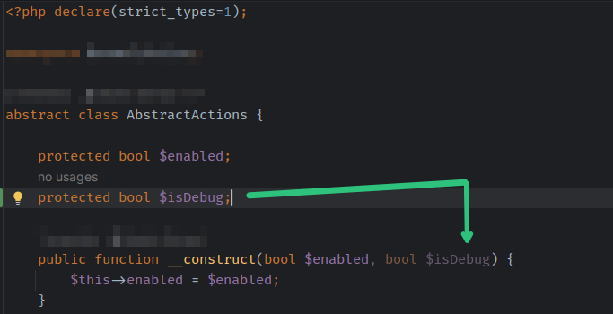

# Vulcan Sweep

Installable releases are published at
https://github.com/forstjiri/sweep-autocomplete-plugin/releases.

This project is a fork of [Sweep Autocomplete](https://blog.sweep.dev/posts/oss-next-edit).
It provides a local alternative to JetBrains Next Edit Suggestions, using the
Sweep next-edit models (0.5B–7B) to predict and apply edits anywhere in the file.

## See It In Action



<video controls width="683">
  <source src="https://raw.githubusercontent.com/forstjiri/sweep-autocomplete-plugin/main/promo/next.mp4" type="video/mp4">
  <a href="https://github.com/forstjiri/sweep-autocomplete-plugin/blob/main/promo/next.mp4">Watch the promo video</a>
</video>


The plugin supports:

- Next-edit suggestions at the current cursor position
- Jump-to-edit suggestions elsewhere in the file
- Requesting another suggestion with a steering prompt via configurable shortcut
- Safe offset validation against the current document
- Local inference through llama.cpp (Vulkan, Metal, CUDA, or CPU)

Suggestions are typically generated in a fraction of a second: prompts are
built in-process and n-gram speculative decoding is enabled, depending on the
model, prompt size, hardware, and system load. AMD integrated graphics with
Vulkan are one tested configuration.

## Requirements

Vulcan Sweep needs two things on your machine:

1. **`llama-server`** — the inference engine from [llama.cpp](https://github.com/ggml-org/llama.cpp).
   Install it once and make sure it is on your `PATH`:
   - macOS: `brew install llama.cpp`
   - Linux: a package (e.g. `conda install -c conda-forge llama.cpp`) or build it
     with Vulkan for AMD GPUs: `cmake -B build -DGGML_VULKAN=ON && cmake --build build`
     (binary at `build/bin/llama-server`)
   - Windows: a [llama.cpp release](https://github.com/ggml-org/llama.cpp/releases)
     build with `llama-server.exe` on your `PATH`
2. **The Sweep model GGUF** (~0.5–4 GB depending on the selected model) —
   downloaded once on first start from
   [Hugging Face](https://huggingface.co/sweepai) and stored under
   `~/.cache/sweep/models`.

No Python, no `uv`, nothing else to install. First start takes a few minutes
(model download); everything afterwards runs fully offline and local.

## Quick Start

1. Install **Vulcan Sweep** from JetBrains Marketplace and make sure
   `llama-server` is on your `PATH` (see Requirements).
2. Open a project and wait for the **Vulcan Sweep Server** terminal tab.
3. On the first start, wait while the selected model downloads. It stays on
   your machine.
4. Put the caret in a writable file and wait for a suggestion. Press `Tab` to
   accept it.

## Local Server

Prompts are built in-process by the plugin; inference runs on `llama-server`,
which the plugin starts in the visible PhpStorm/IntelliJ terminal (never as a
hidden background process) with n-gram speculative decoding enabled. The plugin
checks the server health periodically and skips autocomplete requests while the
server is unavailable.

To test manually, start llama-server with a Sweep model:

```bash
llama-server -m sweep-next-edit-0.5b.q8_0.gguf --port 8081 -ngl -1 --flash-attn auto
```

### Troubleshooting

If the server exits unexpectedly, its stderr remains visible in the terminal.
The plugin also prints the exit code and points to Vulkan/AMDGPU logs. On Linux,
check crashes with:

```bash
journalctl -k -b --no-pager | grep -Ei 'segfault|amdgpu|vulkan|oom|killed'
```

## Building

Open the project in IntelliJ and click **Run Plugin** in the top right corner.
To build an installable ZIP:

```bash
./gradlew buildPlugin
```

The resulting archive is written to `build/distributions/`.

## Customizing Autocomplete Keystrokes

The autocomplete accept and reject keystrokes are fully customizable via
IntelliJ's keymap settings.

### Default Keystrokes

- **Accept Completion**: `Tab`
- **Reject Completion**: `Escape`
- **Show Next Suggestion**: no default shortcut

### How to Customize

1. Open **Settings/Preferences** -> **Keymap**
2. Search for **Accept Edit Completion**, **Reject Edit Completion**, or
   **Show Next Autocomplete Suggestion**
3. Right-click on the action and select **Add Keyboard Shortcut**
4. Assign your preferred keystroke
5. The plugin will automatically adapt to your custom keystrokes without
   requiring a restart

The next-suggestion action first uses alternatives already returned by the
server. When those are exhausted, it requests a new suggestion from the current
cursor; if the server cannot produce a new one, it cycles through cached
suggestions for the current document.

The next-suggestion action has no default shortcut to avoid conflicts. Assign
one in the Keymap settings.

The keystroke must map to a standard editor action to be intercepted reliably.
